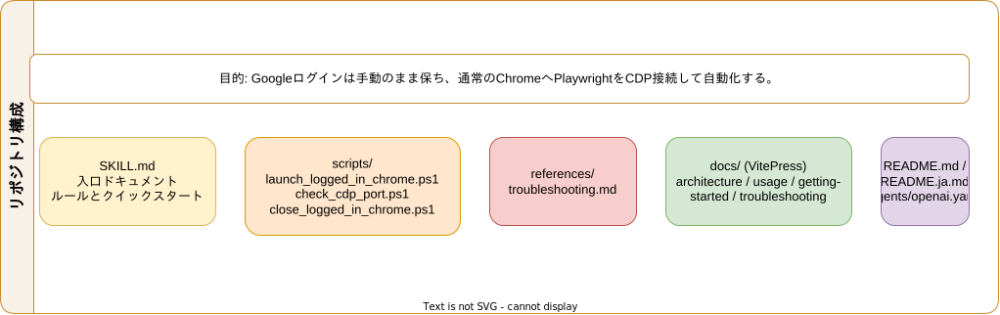
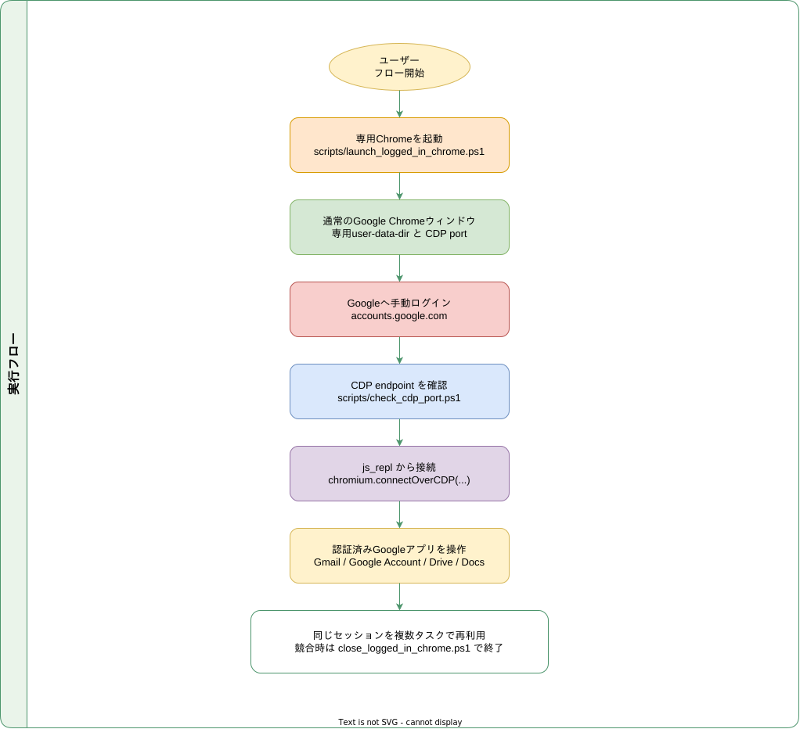
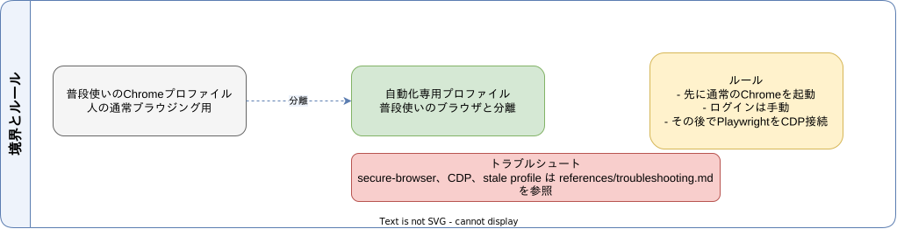

<div align="center">
  <h1>Logged In Google Chrome Skill</h1>
  
  <p>
    
    
    
    
  </p>
  <p>
    <a href="./README.md">
      
    </a>
    <a href="./README.ja.md">
      
    </a>
  </p>
</div>

通常の Google Chrome を専用プロファイルで起動し、人間が先に Google ログインを済ませたあとで、Playwright を CDP 接続でぶら下げるためのリポジトリです。Playwright 起動ブラウザに対して Google が出す「このブラウザまたはアプリは安全でない可能性があります」を避けたいときに使います。

## 🎬 デモ

https://x.com/haru_maki_ch/status/2031011134564872538

## ✨ 特徴

- Gmail、Google アカウント、各種 Google アプリ用に専用 Chrome プロファイルを分離できる
- 普段使いの Chrome プロファイルを自動操作に巻き込まない
- ログイン後に `chromium.connectOverCDP(...)` で Playwright を接続できる
- ログイン済み Chrome セッションを複数のエージェント作業で再利用できる
- 起動・終了・CDP 確認用の PowerShell スクリプトが入っている
- 英語 / 日本語の VitePress ドキュメントを同梱している

## 🎯 このリポジトリの狙い

Google ログインは、Playwright から直接起動したブラウザだと次のような警告で弾かれることがあります。

> このブラウザまたはアプリは安全でない可能性があります

この repo では次の流れを前提にしています。

1. 専用 `--user-data-dir` 付きの通常 Chrome を起動する
2. ユーザーが手動で Google ログインする
3. ログイン後に Playwright を CDP 接続でアタッチする

## 📋 必要環境

- Windows
- Google Chrome
- Node.js 20 以上推奨
- `js_repl` から接続する場合は、どこかのワークスペースに `playwright` または `playwright-core`

## 🗂️ ディレクトリ構成

```text
logged-in-google-chrome-skill/
|- SKILL.md
|- README.md
|- README.ja.md
|- agents/
|  `- openai.yaml
|- references/
|  `- troubleshooting.md
|- scripts/
|  |- launch_logged_in_chrome.ps1
|  |- close_logged_in_chrome.ps1
|  `- check_cdp_port.ps1
`- docs/
   |- .vitepress/
   |- en/
   |- guide/
   |- ja/
   `- public/
```

## 🚀 クイックスタート

### 1. 専用 Chrome を起動

```powershell
powershell -ExecutionPolicy Bypass -File .\scripts\launch_logged_in_chrome.ps1
```

起動スクリプトは、次の 2 条件がそろうまで成功として扱いません。

- 専用 `UserDataDir` を使う `chrome.exe` プロセスが存在すること
- CDP エンドポイント `http://127.0.0.1:<port>/json/version` に到達できること

デフォルト値:

- User data dir: `%LOCALAPPDATA%\logged-in-google-chrome-skill\chrome-profile`
- CDP port: `9222`
- 起動 URL: `https://accounts.google.com/`

### 2. Google に手動ログイン

起動した Chrome ウィンドウで、普段どおり自分でログインします。

### 3. CDP ポートを確認

```powershell
powershell -ExecutionPolicy Bypass -File .\scripts\check_cdp_port.ps1
```

専用プロフィールの Chrome プロセスが見つからない場合や、CDP エンドポイント確認に失敗した場合は、そのまま Playwright 接続へ進まないでください。

### 4. Playwright を接続

```javascript
var chromium;
var attachedBrowser;
var attachedContext;
var attachedPage;

{
  const nm = await import("node:module");
const path = await import("node:path");
const requireForPw = nm.createRequire(path.join(process.cwd(), "package.json"));
  ({ chromium } = requireForPw("playwright-core"));

  attachedBrowser = await chromium.connectOverCDP("http://127.0.0.1:9222");
  attachedContext = attachedBrowser.contexts()[0];
  attachedPage = attachedContext.pages()[0];
}
```

## 🛠️ スクリプト一覧

| スクリプト | 用途 |
| --- | --- |
| `scripts/launch_logged_in_chrome.ps1` | 専用 user-data-dir と CDP ポート付きで通常 Chrome を起動 |
| `scripts/close_logged_in_chrome.ps1` | 専用プロファイルを使っている Chrome をまとめて終了 |
| `scripts/check_cdp_port.ps1` | CDP ポート到達性を確認 |

## 🔒 運用ルール

- `%LOCALAPPDATA%\Google\Chrome\User Data` を Playwright に直接渡さない
- Google ログイン自体は Playwright 起動 Chrome で行わない
- 自動操作用には必ず専用プロファイルディレクトリを使う
- 手動ログイン完了後にだけ Playwright を接続する

## 📚 ドキュメント

- 英語 docs: [Project Docs](https://sunwood-ai-labs.github.io/logged-in-google-chrome-skill/)
- 日本語 docs: [日本語ドキュメント](https://sunwood-ai-labs.github.io/logged-in-google-chrome-skill/ja/)
- リリースノート: [English](https://sunwood-ai-labs.github.io/logged-in-google-chrome-skill/guide/release-notes) / [日本語](https://sunwood-ai-labs.github.io/logged-in-google-chrome-skill/ja/guide/release-notes)
- ローカル起動:

```bash
cd docs
npm install
npm run docs:dev
```

Draw.io files:

- Repository Structure: [SVG](./docs/public/logged-in-google-chrome-repository-structure.svg) / [Draw.io](./docs/public/logged-in-google-chrome-repository-structure.drawio)
- Runtime Workflow: [SVG](./docs/public/logged-in-google-chrome-runtime-workflow.svg) / [Draw.io](./docs/public/logged-in-google-chrome-runtime-workflow.drawio)
- Boundaries and Rules: [SVG](./docs/public/logged-in-google-chrome-boundaries-and-rules.svg) / [Draw.io](./docs/public/logged-in-google-chrome-boundaries-and-rules.drawio)
- Repository Structure (JA): [SVG](./docs/public/logged-in-google-chrome-repository-structure-ja.svg) / [Draw.io](./docs/public/logged-in-google-chrome-repository-structure-ja.drawio)
- Runtime Workflow (JA): [SVG](./docs/public/logged-in-google-chrome-runtime-workflow-ja.svg) / [Draw.io](./docs/public/logged-in-google-chrome-runtime-workflow-ja.drawio)
- Boundaries and Rules (JA): [SVG](./docs/public/logged-in-google-chrome-boundaries-and-rules-ja.svg) / [Draw.io](./docs/public/logged-in-google-chrome-boundaries-and-rules-ja.drawio)
- [Architecture guide](./docs/guide/architecture.md)

### Repository Structure (JA)



### Runtime Workflow (JA)



### Boundaries and Rules (JA)



## 🧪 事例

関連レポートの [`logged-in-google-chrome-skill-test`](https://github.com/Sunwood-ai-labs/logged-in-google-chrome-skill-test) では、このワークフローを Google Apps Script 上で最後まで通した実例を確認できます。

- `%LOCALAPPDATA%\logged-in-google-chrome-skill\chrome-profile` の専用 Chrome プロファイルを起動
- Google に手動ログインした後で Playwright を CDP 接続
- `script.google.com` を開き、`Sample Sales Spreadsheet Generator` という Apps Script プロジェクトを作成
- `createSampleSalesSpreadsheet()` を投入して実行
- `Orders` シートと `Summary` シートを持つスプレッドシートが Google Drive に生成されることを確認

この事例は、Gmail の閲覧だけでなく、認証済みセッションの再利用、エディタ操作、権限承認、スクリプト実行、Drive への成果物生成までを一連で扱えることを示しています。

- 詳細ドキュメント: [Apps Script 事例](./docs/ja/guide/case-studies.md)
- 元レポート: [logged-in-google-chrome-skill-test](https://github.com/Sunwood-ai-labs/logged-in-google-chrome-skill-test)

## 💡 想定ユースケース

- Gmail をログイン済み状態で開き、エージェントに下書きや送信を任せる
- Google アカウント設定、Google Drive、Google Docs などを同じログインセッションで扱う
- 普段使い Chrome を汚さずに、エージェント用ブラウザ運用を安定化させる

## 📄 ライセンス

ログイン済み Google Chrome 運用を実務で回しやすくするための実用リポジトリとして提供しています。
