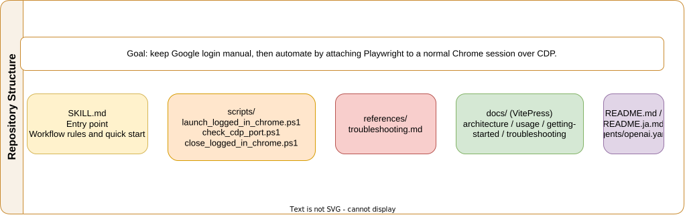
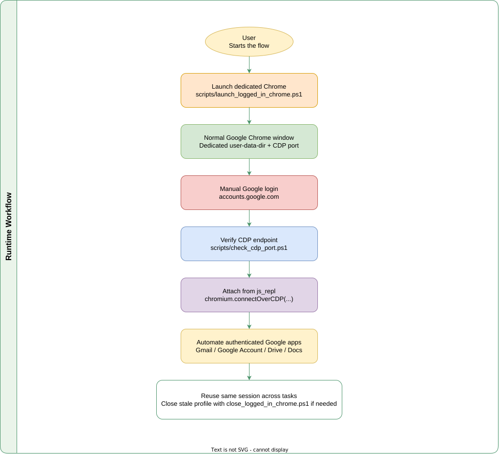
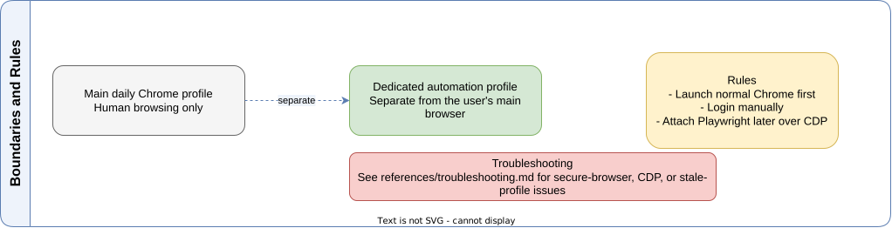

<div align="center">
  <h1>Logged In Google Chrome Skill</h1>
  
  <p>
    
    
    
    
  </p>
  <p>
    <a href="./README.md">
      
    </a>
    <a href="./README.ja.md">
      
    </a>
  </p>
</div>

Use a normal Google Chrome window with a dedicated profile directory, log into Google manually, and then attach Playwright over CDP. This workflow avoids the "This browser or app may not be secure" block that can appear when Google login is attempted from a Playwright-launched browser.

## 🎬 Demo

https://x.com/haru_maki_ch/status/2031011134564872538

## ✨ Features

- Launch a dedicated Chrome profile that is safe to reuse for Gmail, Google Account, and other Google web apps
- Keep the user's main Chrome profile separate from automation
- Attach Playwright after login by using `chromium.connectOverCDP(...)`
- Reuse the same logged-in Chrome session across multiple agent tasks
- Include helper scripts for launch, shutdown, and CDP port verification
- Ship bilingual project docs with VitePress in English and Japanese

## 🎯 Why This Exists

Google login often rejects automation-first browser sessions with a message similar to:

> This browser or app may not be secure

This repository uses a more stable pattern:

1. Start regular Google Chrome with a dedicated `--user-data-dir`
2. Let the user log in manually
3. Attach Playwright over CDP only after login succeeds

## 📋 Requirements

- Windows
- Google Chrome installed
- Node.js 20+ recommended
- A workspace with `playwright` or `playwright-core` available when attaching from `js_repl`

## 🗂️ Repository Layout

```text
logged-in-google-chrome-skill/
|- SKILL.md
|- README.md
|- README.ja.md
|- agents/
|  `- openai.yaml
|- references/
|  `- troubleshooting.md
|- scripts/
|  |- launch_logged_in_chrome.ps1
|  |- close_logged_in_chrome.ps1
|  `- check_cdp_port.ps1
`- docs/
   |- .vitepress/
   |- en/
   |- guide/
   |- ja/
   `- public/
```

## 🚀 Quick Start

### 1. Launch dedicated Chrome

```powershell
powershell -ExecutionPolicy Bypass -File .\scripts\launch_logged_in_chrome.ps1
```

The launch script now waits until both of these are true before it reports success:

- a `chrome.exe` process is using the dedicated `UserDataDir`
- the CDP endpoint `http://127.0.0.1:<port>/json/version` is reachable

Default values:

- User data dir: `%LOCALAPPDATA%\logged-in-google-chrome-skill\chrome-profile`
- CDP port: `9222`
- Login URL: `https://accounts.google.com/`

### 2. Log into Google manually

Open the launched Chrome window and complete login yourself.

### 3. Verify the CDP port

```powershell
powershell -ExecutionPolicy Bypass -File .\scripts\check_cdp_port.ps1
```

Do not continue to Playwright attach if the dedicated-profile Chrome process is missing or the CDP endpoint check fails.

### 4. Attach Playwright

```javascript
var chromium;
var attachedBrowser;
var attachedContext;
var attachedPage;

{
  const nm = await import("node:module");
const path = await import("node:path");
const requireForPw = nm.createRequire(path.join(process.cwd(), "package.json"));
  ({ chromium } = requireForPw("playwright-core"));

  attachedBrowser = await chromium.connectOverCDP("http://127.0.0.1:9222");
  attachedContext = attachedBrowser.contexts()[0];
  attachedPage = attachedContext.pages()[0];
}
```

## 🛠️ Scripts

| Script | Purpose |
| --- | --- |
| `scripts/launch_logged_in_chrome.ps1` | Start normal Chrome with a dedicated user-data-dir, then wait until the dedicated-profile process and CDP endpoint are both ready |
| `scripts/close_logged_in_chrome.ps1` | Close Chrome processes that are using the dedicated profile |
| `scripts/check_cdp_port.ps1` | Verify that the configured CDP endpoint is reachable |

## 🔒 Safety Rules

- Do not point Playwright at `%LOCALAPPDATA%\Google\Chrome\User Data`
- Do not log into Google from a Playwright-launched Chrome profile
- Do use a dedicated Chrome profile directory for automation-assisted work
- Do connect Playwright only after the manual login step is complete
- Do treat "launch command finished" and "Chrome is ready for CDP attach" as separate checks

## 📚 Documentation

- English docs: [Project Docs](https://sunwood-ai-labs.github.io/logged-in-google-chrome-skill/)
- Japanese docs: [日本語ドキュメント](https://sunwood-ai-labs.github.io/logged-in-google-chrome-skill/ja/)
- Release notes: [English](https://sunwood-ai-labs.github.io/logged-in-google-chrome-skill/guide/release-notes) / [日本語](https://sunwood-ai-labs.github.io/logged-in-google-chrome-skill/ja/guide/release-notes)
- Local VitePress setup:

```bash
cd docs
npm install
npm run docs:dev
```

Architecture files:

- Repository Structure: [SVG](./docs/public/logged-in-google-chrome-repository-structure.svg) / [Draw.io](./docs/public/logged-in-google-chrome-repository-structure.drawio)
- Runtime Workflow: [SVG](./docs/public/logged-in-google-chrome-runtime-workflow.svg) / [Draw.io](./docs/public/logged-in-google-chrome-runtime-workflow.drawio)
- Boundaries and Rules: [SVG](./docs/public/logged-in-google-chrome-boundaries-and-rules.svg) / [Draw.io](./docs/public/logged-in-google-chrome-boundaries-and-rules.drawio)
- Repository Structure (JA): [SVG](./docs/public/logged-in-google-chrome-repository-structure-ja.svg) / [Draw.io](./docs/public/logged-in-google-chrome-repository-structure-ja.drawio)
- Runtime Workflow (JA): [SVG](./docs/public/logged-in-google-chrome-runtime-workflow-ja.svg) / [Draw.io](./docs/public/logged-in-google-chrome-runtime-workflow-ja.drawio)
- Boundaries and Rules (JA): [SVG](./docs/public/logged-in-google-chrome-boundaries-and-rules-ja.svg) / [Draw.io](./docs/public/logged-in-google-chrome-boundaries-and-rules-ja.drawio)
- [Architecture guide](./docs/guide/architecture.md)

### Repository Structure



### Runtime Workflow



### Boundaries and Rules



## 🧪 Case Study

The companion report repository [`logged-in-google-chrome-skill-test`](https://github.com/Sunwood-ai-labs/logged-in-google-chrome-skill-test) shows this workflow running end-to-end inside Google Apps Script.

- Launch dedicated Chrome with the reusable profile at `%LOCALAPPDATA%\logged-in-google-chrome-skill\chrome-profile`
- Attach Playwright over CDP after manual Google login
- Open `script.google.com`, create `Sample Sales Spreadsheet Generator`, and paste `createSampleSalesSpreadsheet()`
- Run the script and generate a spreadsheet with `Orders` and `Summary` sheets
- Verify the resulting spreadsheet in Google Drive

This is a strong reference case beyond Gmail because it covers authenticated navigation, browser reuse, editor work, authorization, script execution, and Google Drive output creation in one flow.

- Detailed docs: [Apps Script case study](./docs/guide/case-studies.md)
- Source report: [logged-in-google-chrome-skill-test](https://github.com/Sunwood-ai-labs/logged-in-google-chrome-skill-test)

## 💡 Use Cases

- Open Gmail in a logged-in Chrome session and let an agent draft or send an email
- Reuse a Google account session for account settings, Google Drive, or Google Docs tasks
- Create a repeatable workflow for Codex or Playwright-based agents without touching the user's main browser profile

## 📄 License

This repository is provided as-is for practical automation workflows around logged-in Google Chrome sessions.
